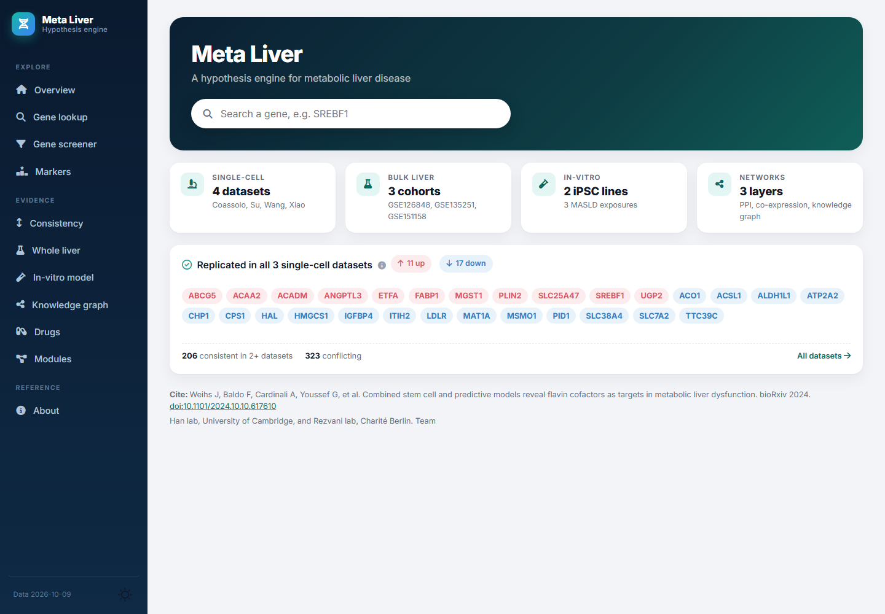
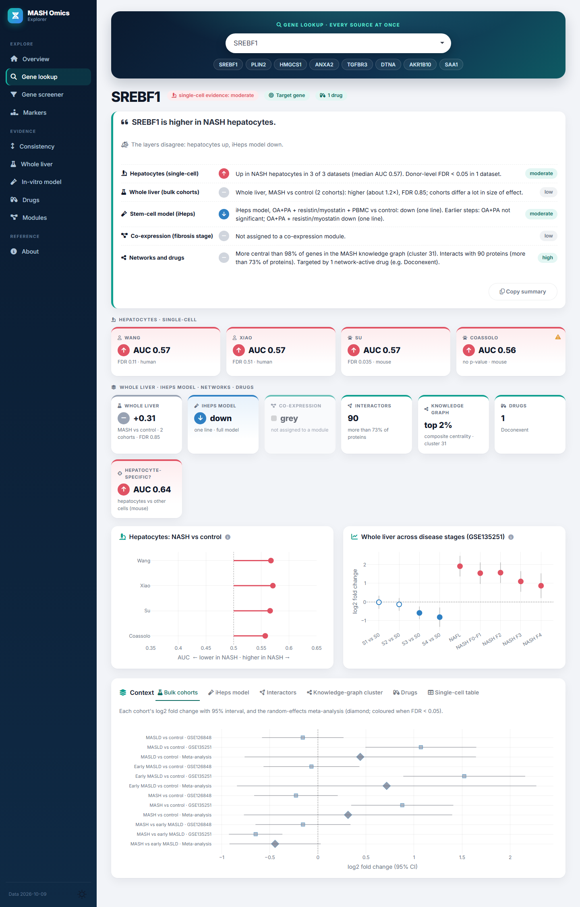
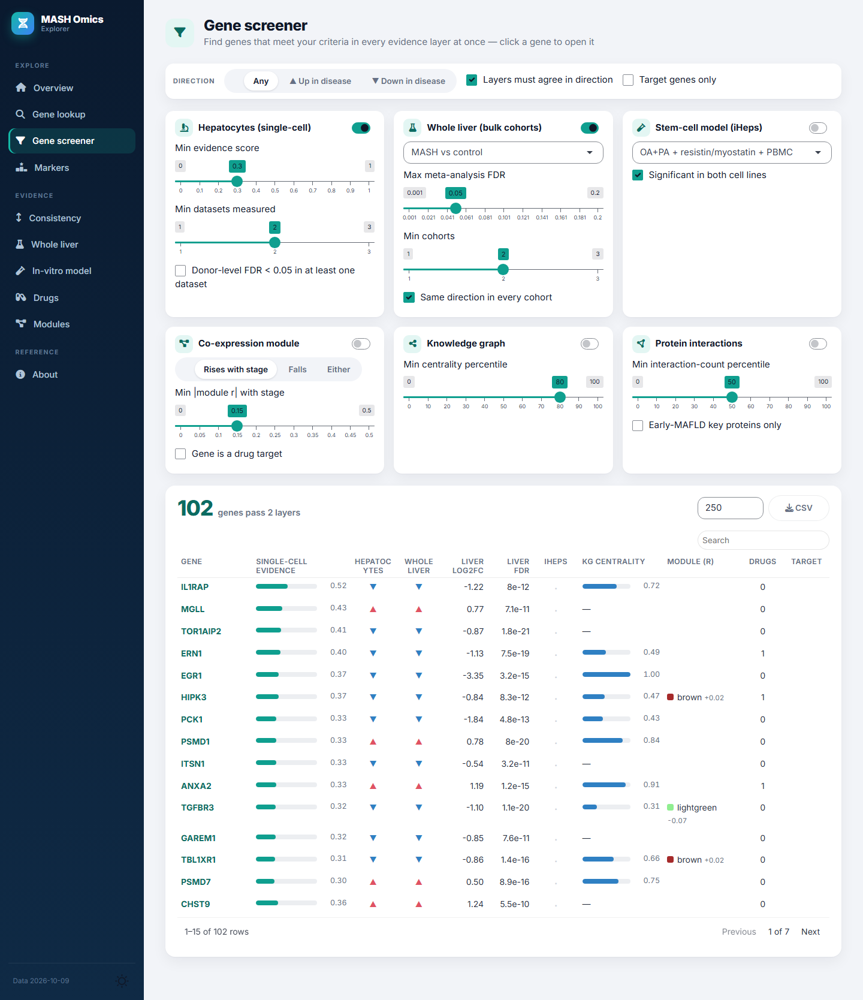
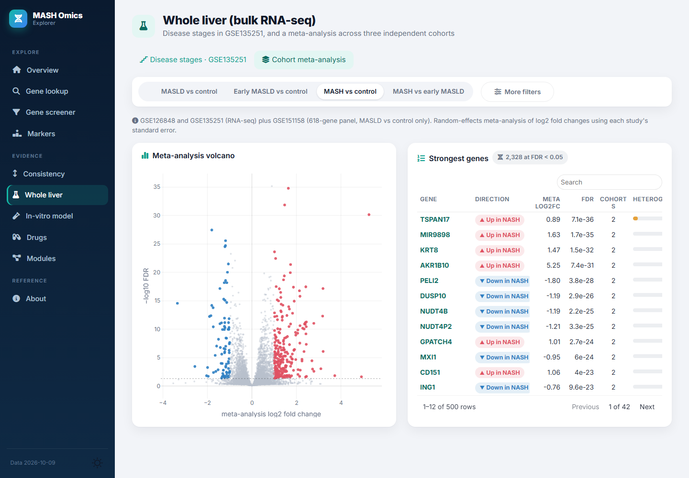
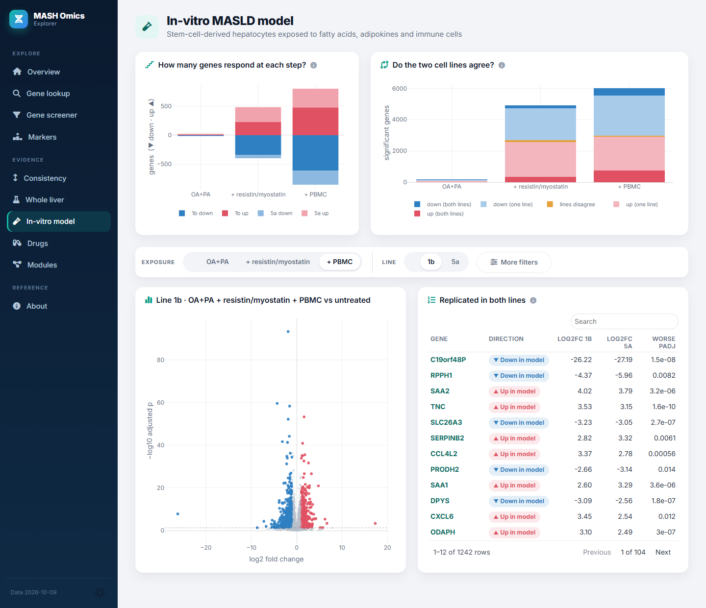
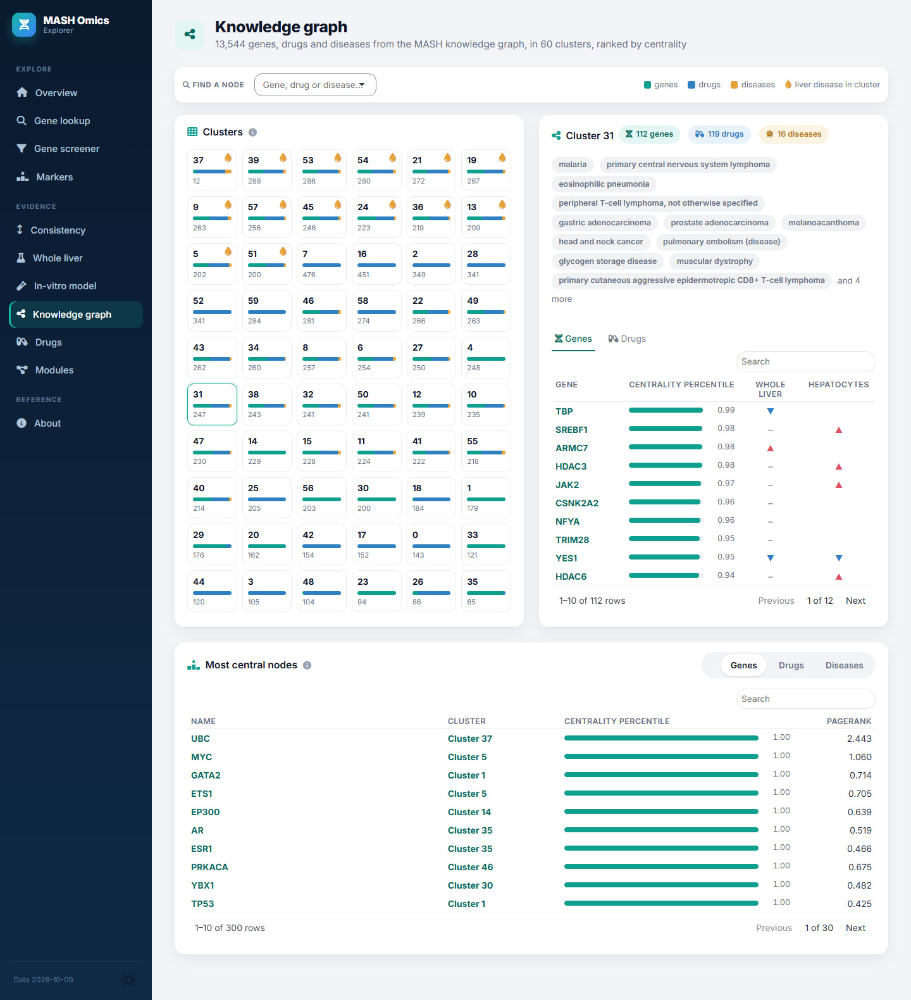
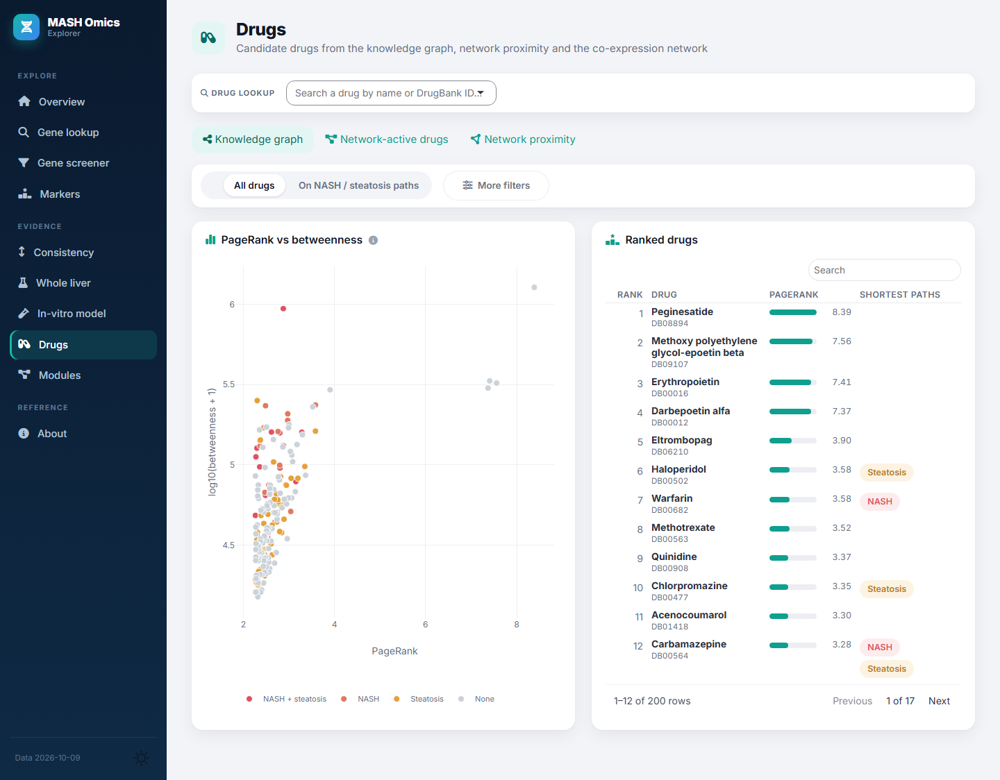

# Meta Liver

A dashboard that brings together single-cell, bulk, in-vitro, network and knowledge-graph
evidence for MASH (formerly NASH), with the pipeline that produces it.

**Open the app:** https://gehadyoussef.github.io/meta-liver/ (runs in the browser, nothing to
install. The first visit takes about 30 seconds to load R in the browser, later visits about 15.)



| Gene lookup | Gene screener |
|---|---|
|  |  |
| **Whole liver: cohort meta-analysis** | **In-vitro model** |
|  |  |
| **Knowledge graph** | **Drugs** |
|  |  |

## Data

| Layer | Source |
|---|---|
| Single-cell hepatocytes | Xiao GSE189600 and Wang GSE212837 (human snRNA-seq), Su GSE166504 and Coassolo GSE210501 (mouse scRNA-seq) |
| Bulk liver | GSE135251 by disease stage, plus a random-effects meta-analysis of GSE126848, GSE135251 and GSE151158 |
| In-vitro model | iPSC-derived hepatocytes (two lines) exposed to oleate/palmitate, then resistin/myostatin, then PBMCs |
| Co-expression | WGCNA modules on GSE135251 and their correlation with fibrosis stage |
| Networks | Protein interaction network (early-MAFLD key proteins, drug proximity) and a MASH knowledge graph |

## Pages

| Page | Shows |
|---|---|
| Home | Gene search, the data layers, genes replicated in every single-cell dataset, citation |
| Gene lookup | A one-paragraph summary across all layers, one tile per layer, charts and context tabs |
| Gene screener | Genes that pass thresholds in the layers you switch on, optionally with the same direction in all of them |
| Markers | Strongest NASH vs control hepatocyte genes per dataset |
| Consistency | One card per single-cell dataset, direction agreement between datasets and with bulk |
| Whole liver | Disease-stage volcano plots and the cohort meta-analysis |
| In-vitro model | Genes changed at each exposure step and whether the two cell lines agree |
| Knowledge graph | The 60 clusters of the MASH knowledge graph, each cluster's diseases, genes and drugs, and the most central nodes |
| Drugs | Drug lookup, knowledge-graph ranking, drugs acting on stage-linked modules, network proximity |
| Modules | Co-expression modules vs stage, with their pathways and genes |
| About | Definitions, methods and data provenance |

Red ▲ means higher in NASH, blue ▼ lower, grey no call.

## Run it locally

```r
source("scripts/00_install_packages.R")   # once
shiny::runApp("app")
```

The app only needs `app/data/app_data.rds`, which is in the repository.

## Rebuild from raw data

```
Rscript scripts/00_download_geo.R    # Su, Coassolo and Wang raw data from GEO (about 2 GB)
Rscript scripts/run_all.R            # pipeline, then app/data/app_data.rds
Rscript -e 'testthat::test_dir("tests/testthat")'
```

Parameters and paths are in `config/config.yml`. Raw data go in `data/raw/` (not committed).

```
app/        Shiny app (one module per page in app/R/mod_*.R)
R/          Functions used by the scripts
scripts/    00 download, 01-05 one script per single-cell dataset, 09 import Meta Liver data,
            10 reference tables, 11 build app data, 12-13 statistics and sensitivity checks,
            14 browser version
data/       Inputs (see data/README.md)
tests/      Unit and app tests
archive/    Original scripts, kept for reference
```

The browser version is built by `scripts/14_build_site.R` and served from the `gh-pages`
branch.

## Methods in brief

- **Per-gene effect:** AUC of NASH vs control hepatocytes, computed after down-sampling the
  deeper group so both have the same sequencing depth. Genes detected in fewer than 10% of
  cells in both groups are not tested.
- **p-values:** counts summed per donor or animal and tested with edgeR. Coassolo has one
  animal per group, so it has no p-values.
- **Hepatocytes:** each cluster is scored on 7 lineage marker panels and called non-hepatocyte
  when one lineage scores as an outlier. Contaminating single cells are then removed.
- **QC:** mitochondrial cut-off set per capture (median + 3 MAD), since control and NASH
  captures were prepared differently.
- **Mouse to human:** MGI one-to-one orthologs.
- **Bulk meta-analysis:** DerSimonian-Laird random effects on log2 fold changes, with I² and
  BH FDR.
- **Single-cell evidence score:** geometric mean of effect strength, stability across
  datasets and net direction agreement, multiplied by the share of datasets that measured the
  gene.

## Findings

| Dataset | Design (donors or animals) | Hepatocytes | Pseudobulk FDR < 0.05 | Agreement with bulk |
|---|---|---|---|---|
| Xiao, human | 3 NASH vs 3 healthy | 27,210 | 7 | 0.54 (r = 0.18) |
| Wang, human | 9 NASH vs 3 control | 120,022 | 183 | 0.68 (r = 0.28) |
| Su, mouse | 3 diet vs 6 chow | 17,283 | 1,023 | 0.40 (r = -0.06) |
| Coassolo, mouse | 1 NASH vs 1 chow | 7,827 | not testable | not usable: 91% of genes move one way |

Agreement with bulk is the share of genes significant in bulk (NASH F2-F4 vs control) that
move the same way in hepatocytes. 0.5 is chance.

- **A steatosis programme replicates.** 28 genes move the same way in Xiao, Wang and Su: up
  SREBF1, PLIN2, FABP1, ANGPTL3 and fatty-acid oxidation genes, down cholesterol synthesis
  (HMGCS1, MSMO1, LDLR) and urea cycle genes (CPS1, HAL, MAT1A). These also rank highest on the
  evidence score.
- **The two human datasets disagree.** Xiao and Wang agree on direction for only 34% of genes.
  This holds under seven processing variants, without FACS-sorted captures and with ambient RNA
  correction (decontX), so it reflects the cohorts rather than the processing. Wang agrees
  better with bulk.
- **Ambient RNA correction is off by default.** DecontX lowered agreement with bulk in both
  human datasets.
- **The mouse diet model differs from human disease.** Su agrees with human bulk below chance.
- **Much of the agreement in the original analysis came from artefacts:** lower sequencing
  depth in disease cells, and non-hepatocytes in the Su hepatocyte libraries.

Full tables are in `data/single_cell/consistency/`.

## Changes from the original analysis

| Original | Now |
|---|---|
| Untested genes coded as AUC = 0 (perfectly lower in NASH) | AUC is missing for untested genes |
| p-values treated every cell as a replicate | Pseudobulk per donor with edgeR |
| Signature AUC measured on the cells used to pick the genes | Measured on held-out donors |
| Hepatocytes gated per cell on Alb, Ttr or Cyp2e1 | Cluster-level lineage annotation plus a per-cell purity filter |
| Fixed 5% mitochondrial cut-off removed more control than NASH cells | Cut-off set per capture |
| Captures from one liver counted as separate samples | The donor or animal is the sample |
| Mouse genes mapped to human by upper-casing | MGI one-to-one orthologs |
| Lower depth in disease cells made most genes look down | Depth-matched AUC, and skewed datasets flagged |
| Meta Liver screener returned the alphabetically first N genes | Ranked by evidence, then cut |
| Meta Liver combined cohorts with Stouffer's method on adjusted p-values | Random-effects meta-analysis of fold changes |
| Meta Liver counted a missing padj as significant, and duplicate genes as both lines | Fixed |
| Meta Liver evidence score let conflicting or single-dataset genes rank high | Net agreement and coverage in the score |

The Streamlit version of Meta Liver is kept at tag `streamlit-v1`.

## Citation and team

Weihs J, Baldo F, Cardinali A, Youssef G, et al. Combined stem cell and predictive models reveal
flavin cofactors as targets in metabolic liver dysfunction. bioRxiv 2024.
[doi:10.1101/2024.10.10.617610](https://doi.org/10.1101/2024.10.10.617610)

Computational biology: Prof Namshik Han (University of Cambridge) and team. Dr Gehad Youssef led
the single-cell and PPI network analyses, Dr Fatima Baldo the knowledge graph and Dr Alessandra
Cardinali the WGCNA analyses. Experimental models: Dr Milad (Milo) Rezvani (Charité Berlin) and
team. Julian Weihs led the MASLD in-vitro model.

## Open questions

- Su chow ages are not on GEO. Set `control_age_pattern` in the config if known.
- The target gene list was recovered from the Coassolo results (621 genes). Replace
  `data/reference/target_genes_mouse.txt` with the original list if available.
- The MetaLiver DEG tables in `data/external/metaliver/degs/` lost their decimal separators in
  Excel and are not used.
- No licence has been chosen yet. Check the terms of third-party data before reuse.
